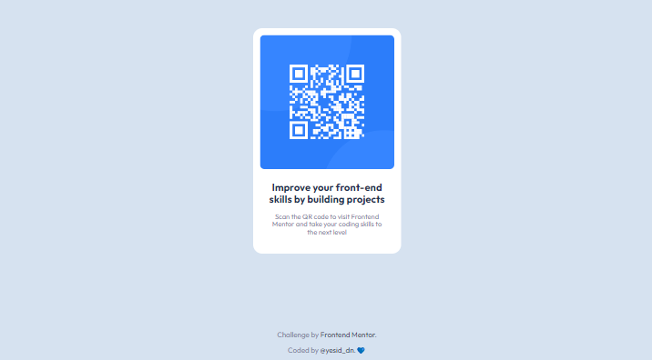

# QR code component solution - Frontend Mentor

This is my solution to the [QR code component challenge on Frontend Mentor](https://www.frontendmentor.io/challenges/qr-code-component-iux_sIO_H).

## Table of contents

- [QR code component solution - Frontend Mentor](#qr-code-component-solution---frontend-mentor)
  - [Table of contents](#table-of-contents)
  - [Overview](#overview)
    - [Screenshot](#screenshot)
    - [Links](#links)
  - [My process](#my-process)
    - [Built with](#built-with)
    - [What I learned](#what-i-learned)
    - [Useful resources](#useful-resources)
  - [Author](#author)

## Overview

### Screenshot

**Mobile design**


**Desktop design**



### Links

- Solution URL: [github.com/yesiddn/qr-code-component](https://github.com/yesiddn/qr-code-component)
- Live site URL: [yesiddn.github.io/qr-code-component](https://yesiddn.github.io/qr-code-component/)

## My process

### Built with

- Semantic HTML5 markup
- CSS custom properties
- Flexbox
- Mobile-first workflow

### What I learned

When you advance in your knowledge of Web Development you forget things (that can be remembered again in Google) and this is my case with CSS. Reinforced knowledge:

- Make an image fit its container:

I know, basic. But I didn't remember it well. With these styles you will make the image adapt to any size of the container and also give it a maximum size.
```css
img {
  width: 100%;
  max-width: 250px;
}
```

### Useful resources

- [MDN - HTML Documentation](https://developer.mozilla.org/es/docs/Learn/HTML) - If you have any questions about any HTML tag, here you will find its documentation.
- [MDN - CSS Documentation](https://developer.mozilla.org/es/docs/Learn/CSS) - As with HTML, Mozilla has excellent CSS documentation, don't forget to take a look.

## Author

- GitHub - [Duvan Yesid](https://github.com/yesiddn)
- Frontend Mentor - [@yesiddn](https://www.frontendmentor.io/profile/yesiddn)
- Twitter - [@yesid_dn](https://twitter.com/yesid_dn)

<center>

Made with 💜, by [@yesid_dn](https://twitter.com/yesid_dn).

</center>